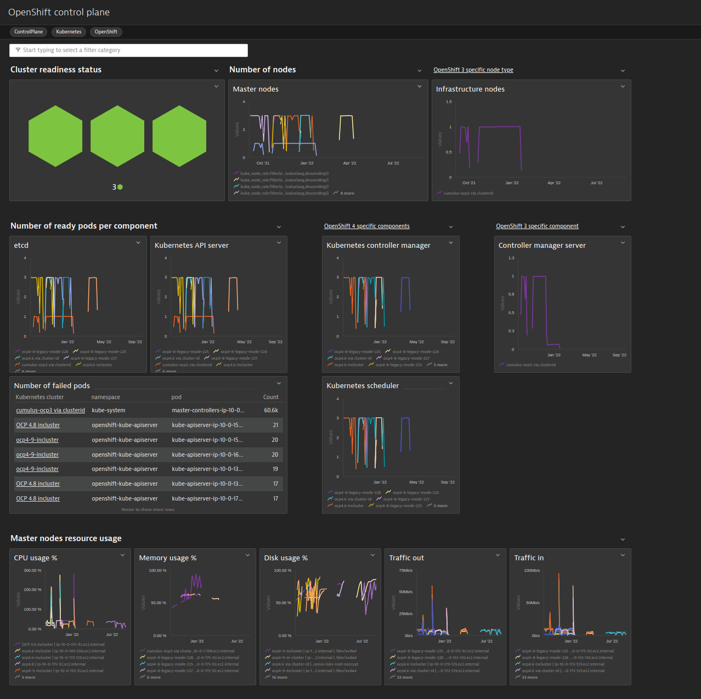

# OpenShift control plane
This extension provides you with deep insights into your self-managed [OpenShift](https://www.openshift.com/) control plane. It provides an out-of-the-box [dashboard](#screenshots) and pre-configured [alerts](#alerts). To give you a brief impression of what you get with this extension, have a look at the [screenshots](#screenshots) below. Of course, you can also build your own [dashboards](https://www.dynatrace.com/support/help/shortlink/custom-dashboards) and [metric events for alerting](https://www.dynatrace.com/support/help/shortlink/metric-events-for-alerting) based on the metrics coming with this extension.

## <a name="screenshots"></a>Screenshots
Dashboard             |  
:-------------------------:|
  |

## <a name="permissions"></a> Prerequisites and supported versions

* Dynatrace version 1.220+
* ActiveGate version 1.220+ running within the Kubernetes cluster. To have an ActiveGate in your Kubernetes cluster, deploy Dynatrace using [Dynatrace Operator](https://www.dynatrace.com/support/help/shortlink/full-stack-dto-k8) (recommended) or deploy an [ActiveGate as a StatefulSet](https://www.dynatrace.com/support/help/shortlink/connect-kubernetes-clusters).
* OpenShift 4 and OpenShift 3 (self-managed)


## Install extension

Follow the steps to install the OpenShift control plane extension.

### 1. Enable Prometheus monitoring in Dynatrace
In your Dynatrace environment, go to **Settings** > **Cloud and virtualization** > **Kubernetes** and turn on **Enable monitoring** and **Monitor Prometheus exporters**. For more information see our [official documentation](https://www.dynatrace.com/support/help/shortlink/monitor-prometheus-metrics).

### <a name="ingestmetrics"></a> 2. Start ingesting control plane metrics
To ingest metrics exposed by the OpenShift control plane, the related services need to be annotated with specific Dynatrace annotations. Based on the used OpenShift version, use the corresponding instructions below. Before executing any of the instructions below, ensure your kubectl is configured to use the Kubernetes cluster you want to monitor.

#### OpenShift 4
```
kubectl apply -f https://raw.githubusercontent.com/dynatrace-extensions/kubernetes-control-plane/main/scripts/control-plane-monitoring-annotations-ocp4.yaml
```
#### OpenShift 3
```
kubectl apply -f https://raw.githubusercontent.com/dynatrace-extensions/kubernetes-control-plane/main/scripts/control-plane-monitoring-annotations-ocp3.yaml
```

#### Verification and troubleshooting
After some minutes, you can verify if everything works as expected by finding control plane related metrics using [Dynatrace metrics browser](https://www.dynatrace.com/support/help/shortlink/metrics-browser). `kube_pod_status_ready` is one of the metrics to search for.


For troubleshooting and further annotation methods, see [Monitor Prometheus metrics](https://www.dynatrace.com/support/help/shortlink/monitor-prometheus-metrics) in Dynatrace documentation.

### 3. Install the extension package
To get the out-of-the-box dashboard and pre-configured alerts included in this extension, navigate to the **Dynatrace Hub** within Dynatrace and search for "OpenShift". Select the "OpenShift control plane" tile and follow the on-screen guidance to activate the extension. After activating the extension, select **Dashboards** in Dynatrace. You should now find an out-of-the-box **OpenShift control plane** dashboard.

</br>

### 4. Activate metric events for alerting
Additionally, the extension comes with multiple pre-configured metric events for alerting. To activate them:
1. From the Dynatrace navigation menu, select **Settings** > **Anomaly detection** > **Custom events for alerting**.
2. <a name="alerts"></a>Find the following events

   </br>

   
   * **OpenShift control plane: cluster not ready:** notifies you if the cluster is not ready (based on the [readyz](https://kubernetes.io/docs/reference/using-api/health-checks/) API health endpoint).
   * **OpenShift control plane: etcd pod not ready:** notifies you if any etcd pod is not ready.
   * **OpenShift control plane: API server pod not ready:** notifies you if any API server pod is not ready.
   * **OpenShift 4 specific events:**
      * **OpenShift control plane: low number of master nodes:** notifies you if the number of master nodes is below a specified threshold.
      * **OpenShift control plane: DNS pod not ready:** notifies you if any DNS pod is not ready.
      * **OpenShift control plane: scheduler pod not ready:** notifies you if any scheduler pod is not ready.
      * **OpenShift control plane: controller manager pod not ready:** notifies you if any controller manager pod is not ready.
   * **OpenShift 3 specific events:**
      * **OpenShift control plane: low number of master nodes:** notifies you if the number of master nodes is below a specified threshold.
      * **OpenShift control plane: controller pod not ready:** notifies you if any controller pod is not ready.
   


3. If necessary, select the **Edit** button to customize the event conditions.
4. Move the switch next an event to the **On** position to activate it.

## Uninstall the extension
### 1. Stop metric ingest
As metric ingest is subject to [DDU consumption](https://www.dynatrace.com/support/help/shortlink/monitor-prometheus-metrics#monitoring-consumption), it is important to stop it by removing the annotations from the related services. If you followed the instructions described in the ["Start ingesting control plane metrics"](#ingestmetrics) section, you can use kubectl to remove the annotations. Before executing any of the instructions below, ensure your kubectl is configured to use the right Kubernetes cluster.

#### OpenShift 4
```
kubectl delete -f https://raw.githubusercontent.com/dynatrace-extensions/kubernetes-control-plane/main/scripts/control-plane-monitoring-annotations-ocp4.yaml
```
#### OpenShift 3
```
kubectl delete -f https://raw.githubusercontent.com/dynatrace-extensions/kubernetes-control-plane/main/scripts/control-plane-monitoring-annotations-ocp3.yaml
```
### 2. Deactivate the extension
To remove the out-of-the-box dashboard and alerts, deactivate the extension via the **Dynatrace Hub**.
